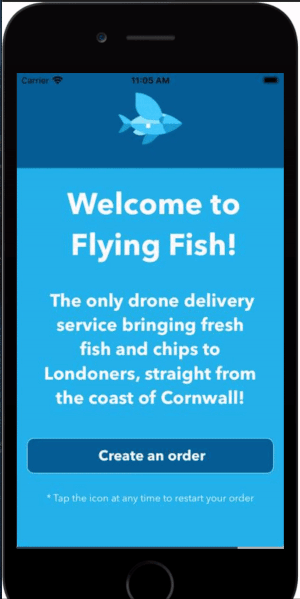

# Flying Fish

A sample app built in Expo Snack using React Native. 

Code and example available at: https://snack.expo.io/@danielle.inkster/flying-fish
**Can only be used on the iOS and Android platforms**

The given parameters:
- Allow the user to search and select a restaurant from 10 fictitious restaurants (use made-up, local data)
- Select between cod & halibut fish and have the ability to add mushy peas to your order
- Type in your delivery address, name, and any special delivery instructions
- Does not need to do anything on "submit"

